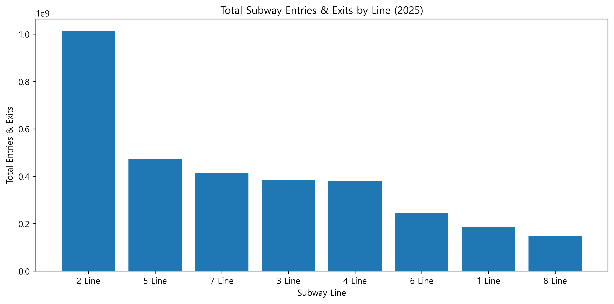
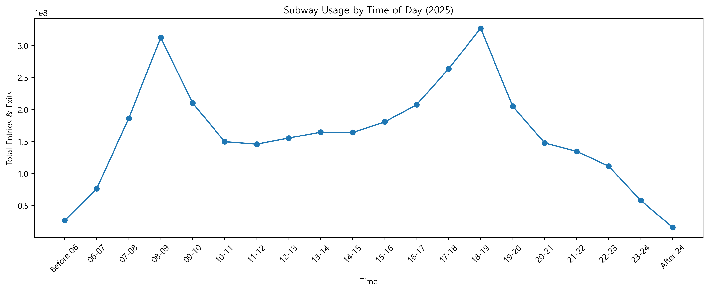
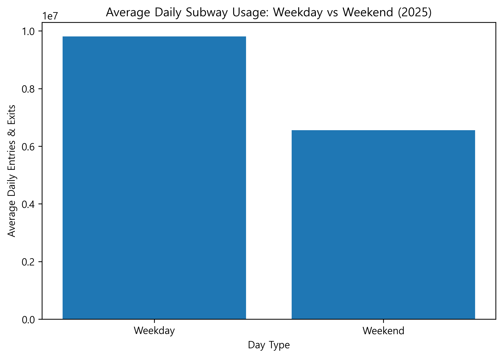
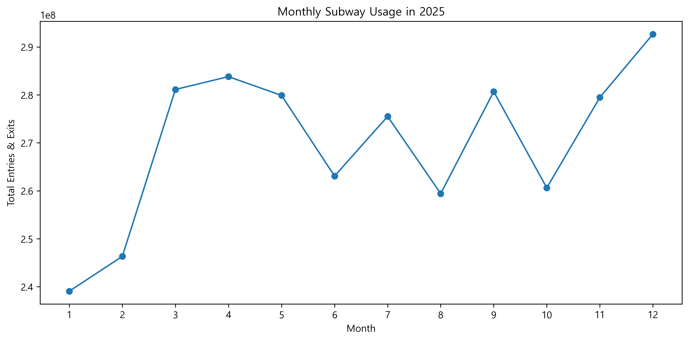
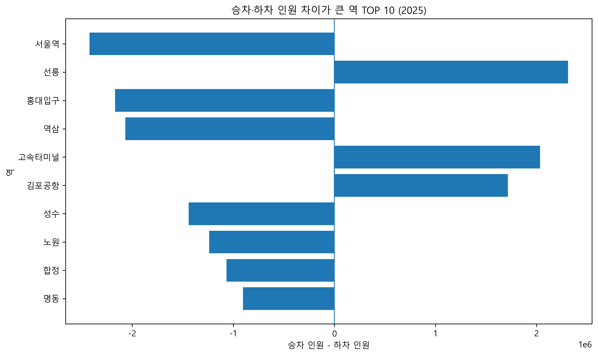

# Seoul Subway Ridership Analysis

A data analysis project exploring **2025 Seoul Metro ridership patterns** using SQLite, SQL, and Python.

The project converts raw public transportation data into a structured SQLite database, performs SQL-based analysis, and visualizes the results with pandas and matplotlib.

[Portfolio](https://incredible-march-0ef.notion.site/Seoul-Subway-Ridership-Analysis-3e968564df5a810fa96de20448ca06fa)

## Implementation

- Built a SQLite database from **199,290 subway ridership records**
- Designed the database schema and loaded cleaned CSV data using Python
- Wrote SQL queries to analyze ridership by station, line, time, day type, and month
- Used conditional aggregation to compare boarding and alighting patterns
- Visualized SQL query results with pandas and matplotlib

## Tech Stack

`Python` · `SQLite` · `SQL` · `pandas` · `matplotlib` · `Jupyter Notebook`

## Key Findings

- **Line 2** recorded the highest total entries and exits among Lines 1–8.
- Ridership showed clear commuting peaks around **08:00–09:00** and **18:00–19:00**.
- Average daily ridership was **9.81M on weekdays** and **6.56M on weekends**, a difference of approximately **49.6%**.
- **December** recorded the highest monthly ridership in 2025; **January** recorded the lowest.

Counts represent **entries plus exits**, rather than unique people or distinct journeys. Weekday/weekend averages divide each group's total by its number of observed dates. Weekdays include public holidays that fall Monday–Friday.

## Analysis

### Ridership by Subway Line



### Ridership by Time of Day



### Weekday vs Weekend



### Monthly Ridership



### Boarding vs Alighting Difference

Positive values indicate more boardings than alightings, while negative values indicate more alightings than boardings.



## Database & SQL

The analysis follows this workflow:

```text
Raw CSV
   ↓
Data Cleaning
   ↓
SQLite Database
   ↓
SQL Analysis
   ↓
pandas
   ↓
Visualization
```

### Table Design

Each row represents a **date × line × station × boarding/alighting direction** record, with 20 time-band count columns.

| Columns | Purpose |
| --- | --- |
| `id` | Auto-increment primary key |
| `date`, `line` | Service date and subway line |
| `station_code`, `station_name` | Station identifiers |
| `direction` | Boarding (`승차`) or alighting (`하차`) |
| `before_06`, `hour_06_07` … `hour_23_24`, `after_24` | Counts by time band |

### SQL Example: Evening Commute by Line

```sql
SELECT line, SUM(hour_18_19) AS entries_and_exits
FROM subway_ridership
GROUP BY line
ORDER BY entries_and_exits DESC;
```

The database schema is defined in [`sql/schema.sql`](sql/schema.sql), and the complete analysis queries are available in [`sql/queries.sql`](sql/queries.sql).

SQL techniques used include:

`GROUP BY` · `SUM` · `ORDER BY` · `CASE WHEN` · `COUNT(DISTINCT)` · `strftime()`

## Project Structure

```text
seoul-subway-analysis/
├── outputs/
│   ├── boarding_alighting_difference.png
│   ├── monthly_passengers.png
│   ├── passengers_by_line.png
│   ├── passengers_by_time.png
│   └── weekday_vs_weekend.png
├── sql/
│   ├── queries.sql
│   └── schema.sql
├── src/
│   └── load_data.py
├── analysis.ipynb
├── README.md
├── requirements.txt
└── .gitignore
```

## Data

**Seoul Metro Daily Hourly Ridership Data (2025)**  
Source: [Seoul Open Data Plaza](https://data.seoul.go.kr/dataList/OA-12921/S/1/datasetView.do)

The dataset contains daily boarding and alighting counts for Seoul Metro Lines 1–8 by station and hourly time period.

The CSV is read with `cp949` encoding. After removing **134 completely empty rows**, **199,290 records** were used for the analysis. The sequence column is removed, and the remaining columns are mapped to the SQLite schema.

The raw dataset and generated SQLite database are not included in this repository.

## Run

Install the required packages:

```bash
pip install -r requirements.txt
```

Create the input, database, and output folders from the repository root:

```bash
python -c "from pathlib import Path; [Path(p).mkdir(parents=True, exist_ok=True) for p in ('data', 'database', 'outputs')]"
```

Place the original CSV at `data/서울교통공사_역별 일별 시간대별 승하차인원_20251231.csv`, then build the database:

```bash
python src/load_data.py
```

The loader creates `database/subway.db` and prints the inserted record count. Rerunning it rebuilds the `subway_ridership` table.

Then run `analysis.ipynb` from the repository root to reproduce the analysis and visualizations. The station-name plot uses the Windows font `Malgun Gothic`; choose an installed Korean font on another platform.

## Validation

The loader and all notebook code cells were rerun with the original CSV. SQLite contained **199,290 records**, all **five chart files** were generated, and the line, hourly, weekday/weekend, and monthly results matched the saved analysis. On non-Windows systems, an installed Korean font is needed to render station labels correctly.

## Limitations & Review

The project separates schema definition, CSV loading, SQL aggregation, and visualization into reusable components. Comparing daily averages rather than raw weekday/weekend totals accounts for the different numbers of days in each group.

The analysis covers Seoul Metro Lines 1–8 for one year. Monthly totals are not normalized by month length, and public holidays are not separated from ordinary weekdays. Station-name aggregation combines records sharing a station name across lines. Multiple years, holiday labels, and daily-normalized monthly comparisons would support more detailed analysis.
